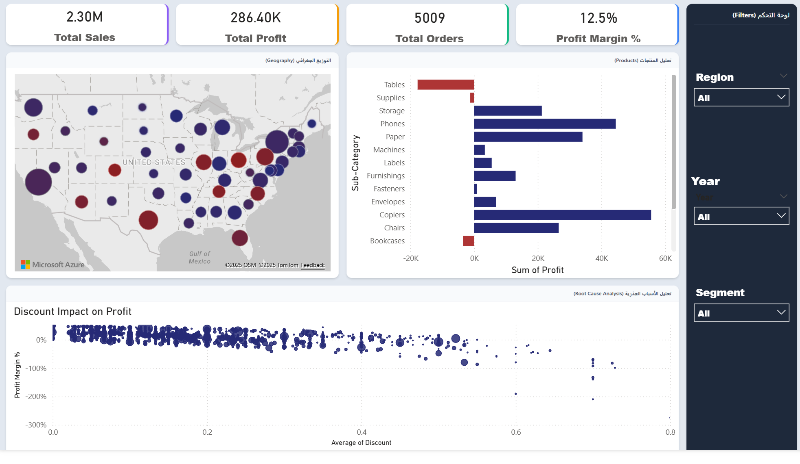

# 📊 Superstore Profitability & Sales Analysis

## 📝 Project Overview
This project is an interactive **Power BI Dashboard** designed to analyze the sales and profitability of a retail superstore. The main objective was to identify "profit leaks" and provide data-driven recommendations to improve the company's bottom line.

Using the **Superstore Dataset**, I transformed raw data into actionable insights, focusing on the correlation between **discounts** and **profitability**.

## 🔍 Key Insights & Findings
- **The "Tables" Trap:** Identified that the *Tables* sub-category is the primary source of loss, despite generating high sales volume.
- **Discount Impact:** Analysis revealed that any discount rate **above 20%** consistently results in a negative profit margin.
- **Regional Performance:** Visualized profit distribution across US states to pinpoint underperforming locations.
- **Sales vs. Profit:** While sales are growing, profit margins fluctuate heavily due to shipping costs and aggressive discounting strategies.

## 🛠️ Tools & Technologies Used
- **Microsoft Power BI:** For data visualization and interactivity.
- **DAX (Data Analysis Expressions):** Created complex measures for *Profit Margin %*, *YoY Growth*, and *Dynamic KPIs*.
- **HTML & CSS:** Designed a custom, modern background layout to enhance User Interface (UI) and User Experience (UX).
- **Power Query (M):** For data cleaning, transformation, and modeling.

## 📈 Dashboard Features
1.  **Executive KPI Cards:** Real-time view of Total Sales, Profit, Orders, and Profit Margin.
2.  **Interactive Filters:** Slicers for *Year*, *Region*, and *Customer Segment*.
3.  **Root Cause Analysis:** A scatter plot visualizing the direct negative correlation between high discounts and profit.
4.  **Geospatial Analysis:** A dual-axis map highlighting sales volume vs. profitability by state.
5.  **Custom UI Design:** A glass-morphism inspired layout created with external HTML/CSS.

## 🚀 How to Run
1.  Download the `Sales_Profitability_Diagnostic_Dashboard.pbix` file from this repository.
2.  Open it in **Power BI Desktop**.
3.  Interact with the slicers to explore different scenarios.

---
**Author:** Osama AlZahrani
[LinkedIn](https://www.linkedin.com/in/osama-al-zahrani-9984b4341/) 
